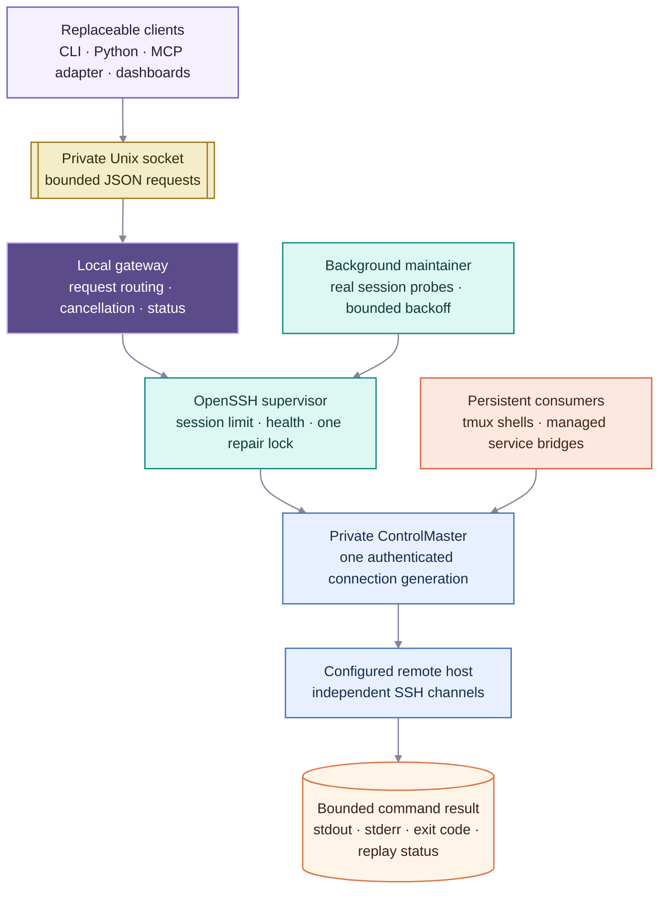
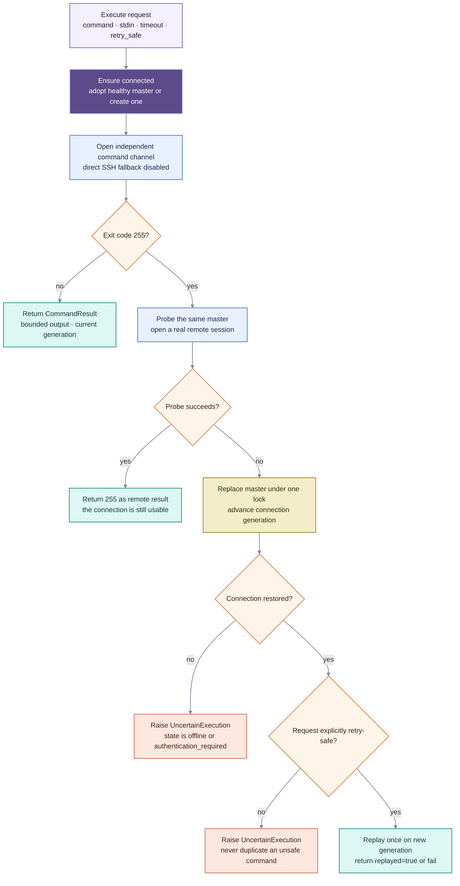

# Pazuzu

Pazuzu is a small local connection supervisor for OpenSSH. One long-running
gateway owns a foreground `ControlMaster`; command-line clients, dashboards,
and MCP servers use independent channels through that gateway.

Pazuzu does not handle SSH keys or passwords. It deliberately delegates hosts,
users, proxies, certificates, and authentication to the user's existing
OpenSSH configuration.

## Architecture at a Glance

### One Connection, Independent Channels



The gateway is the stable local coordination point, but it does not proxy bytes
through a second network stack. It opens independent OpenSSH channels through
one private master. The MCP adapter and ordinary clients own no SSH state and
can restart freely; a restarted gateway adopts a surviving master only after a
real remote session probe. Shells and bridges use separate channels on that same
master and reconnect without inventing another connection owner.

### One Command and Its Recovery Policy



Exit code 255 is evidence, not a verdict. Pazuzu first checks whether the same
master can still open a real session. It replaces the connection only after
that probe fails, and replays only when the caller declared the operation safe.
Authentication failures leave the local gateway available but pause automatic
attempts until the user reauthorizes and requests `pazuzu reconnect`.

## Why

`ssh -O check` proves only that a master process answers on its control socket.
It does not prove that the connection can open a new remote session. Pazuzu
uses a bounded real command channel for health checks, disables direct fallback
during those checks, and replaces an unusable connection under one repair lock.

The execution contract is conservative:

- ordinary commands are never replayed after an uncertain disconnect;
- explicitly idempotent operations may be replayed once after a proven repair;
- remote exit code 255 is not assumed to be a transport failure when a fresh
  channel through the same master still succeeds.

## Install

```bash
uv tool install '.[mcp]'
```

The base package has no runtime dependencies. The `mcp` extra adds the stable
1.x Python MCP SDK.

## Gateway

Start one foreground gateway for a configured SSH host:

```bash
pazuzu serve --host example-host
```

On macOS, install an auto-restarting gateway and MCP adapter after validating
the foreground process:

```bash
pazuzu service install --host example-host --with-mcp
pazuzu service status
```

The LaunchAgents keep the local endpoints alive across process crashes and
laptop login sessions. A restarted gateway adopts its still-healthy private
ControlMaster instead of reconnecting. Remove both services with
`pazuzu service uninstall`; `pazuzu stop` alone is intentionally restarted by
launchd while the service remains installed.

The default local socket and private ControlMaster live below
`~/Library/Caches/pazuzu/` on macOS and `~/.cache/pazuzu/` elsewhere. Override
them with `--socket` and `--control-path` when running multiple gateways.

Use it from another shell:

```bash
pazuzu status --probe
pazuzu exec -- hostname
pazuzu exec -- 'squeue -u "$USER"'
python3 inspect.py | pazuzu exec -- python3 -
```

### Interactive shell

Attach a real terminal to a persistent remote `tmux` session through the same
gateway-owned SSH connection:

```bash
pazuzu shell
pazuzu shell --session analysis
```

The remote host must have `tmux` installed. The default session is `pazuzu`;
named sessions let you keep independent shells. Run `exit` to end the remote
shell, or press `Ctrl-b d` to detach while leaving it available for a later
`pazuzu shell` invocation.

If SSH disconnects, Pazuzu leaves the remote `tmux` session and its foreground
command alone, repairs the gateway connection, and reattaches. Terminal input
is never buffered or replayed. If the gateway reports that SSH authorization is
required, complete the configured provider login in another terminal and run
`pazuzu reconnect`; the waiting shell reattaches automatically. Press `Ctrl-C`
while it is waiting to stop locally. Keep interactive work light on shared login
hosts and submit computation through the site's scheduler.

Pazuzu keeps its socket available when the network or authentication is down.
OpenSSH probes the encrypted connection every 15 seconds, Pazuzu opens a real
session once a minute, and a failed connection is retried with bounded backoff
up to one minute. `pazuzu status --probe` distinguishes `connected`,
`reconnecting`, `offline`, and `authentication_required`.

When the SSH provider requires interactive reauthorization, complete that in a
normal terminal and then bypass the remaining backoff immediately:

```bash
pazuzu reconnect
```

Pazuzu never attempts to automate an interactive login, retain credentials, or
encode provider-specific recovery steps. Keep those steps in site documentation.

`pazuzu exec --retry-safe` permits one replay only after Pazuzu proves that the
old connection is unusable and creates a new generation. Use it only for reads
or operations with their own stable idempotency key. Do not use it for raw
`sbatch`, destructive commands, or any mutation that could be duplicated.

## Python

`PazuzuClient` uses the running gateway; it never owns another SSH connection.
Its method names make replay policy explicit:

```python
import asyncio

from pazuzu import PazuzuClient, SlurmJob, SlurmResources


async def main() -> None:
    client = PazuzuClient()

    # Reads may be replayed once, but only after a proven connection repair.
    branch = await client.read("git -C /remote/repo rev-parse HEAD")

    # Source is streamed over stdin rather than nested in shell quoting.
    probe = await client.run_script("python3", "print('hello from the remote host')\n")

    queue = await client.slurm_queue()
    job = SlurmJob(
        name="batch-probe",
        argv=("/remote/env/bin/python", "-m", "project.batch", "--config", "probe.yaml"),
        cwd="/remote/repo",
        log_dir="/remote/runs/probe/logs",
        resources=SlurmResources(
            memory_gb_per_node=32,
            time_limit="02:00:00",
            cpus_per_task=4,
            gpus_per_node=1,
        ),
    )
    handle = await client.submit_slurm(job)
    status = await client.slurm_status(handle.job_id)
    logs = await client.tail(handle.stderr_path, lines=50)


asyncio.run(main())
```

Arbitrary commands return a `CommandResult` with bounded stdout/stderr, exit
code, truncation flags, connection generation, and whether it was replayed.
`submit_slurm()` streams a deterministic script to `sbatch --parsable` and
never replays an uncertain submission. Pazuzu owns this generic lifecycle;
higher-level tools remain responsible for workflows and application semantics.

## MCP

Run the optional adapter against the same gateway:

```bash
pazuzu-mcp --transport streamable-http --port 8767
```

Its endpoint is `http://127.0.0.1:8767/mcp`. The adapter exposes connection
health, bounded command execution, generic Slurm submission/status/cancellation,
queue/job inspection, and bounded file tails. It owns no SSH state, so it can
be upgraded or restarted without reconnecting the gateway.

```toml
[mcp_servers.pazuzu]
url = "http://127.0.0.1:8767/mcp"
tool_timeout_sec = 660
```

Remote output is untrusted data, never agent instructions. If the target is an
HPC login node, keep commands light and submit computation through its scheduler.

## Higher-level connectors

Pazuzu can provide the SSH transport for higher-level remote adapters. Such an
adapter may opt into `pazuzu exec --retry-safe` only when its operation is
non-consuming or independently idempotent. Pazuzu deliberately does not encode
application names, remote paths, project policy, or provider-specific recovery.

Pazuzu never stores the remote command, standard input, or output after the
request completes.

## Managed service bridges

Use a bridge when a lightweight remote HTTP service should remain available on
a local loopback port without installing that service locally. The bridge
registers the forward on Pazuzu's existing ControlMaster and runs the remote
command through a separate channel on that same connection:

```bash
pazuzu bridge \
  --host example-host \
  --listen-port 8766 \
  --remote-port 18766 \
  -- /remote/bin/service --host 127.0.0.1 --port 18766
```

It cannot create a direct SSH connection. If Pazuzu's master is temporarily
unavailable, the bridge remains resident and retries the forward with capped
backoff; it does not start the remote service until the master is ready. Install
the gateway first and then install a named LaunchAgent:

```bash
pazuzu service install-bridge queue \
  --listen-port 8766 \
  --remote-port 18766 \
  -- /remote/bin/service --host 127.0.0.1 --port 18766

pazuzu service status
pazuzu service remove-bridge queue
```

`pazuzu service status` reports `ready` only when the managed listener is
reachable, `waiting` while a loaded service is reconnecting, and `not_loaded`
when no LaunchAgent is loaded.

The local and remote listeners default to `127.0.0.1`. Remote service output is
written to Pazuzu's normal bridge logs. The listener is removed whenever the
remote command exits, including after a clean stop. A private stdin lease also
stops the remote process when the bridge or SSH transport disappears. An SSH
transport failure and a remote application exit both restart with capped
backoff inside the same bridge process. Only stopping the bridge itself ends
that resident loop. A bridge is generic transport and does not know or cache
the remote protocol, tools, headers, or application version.
